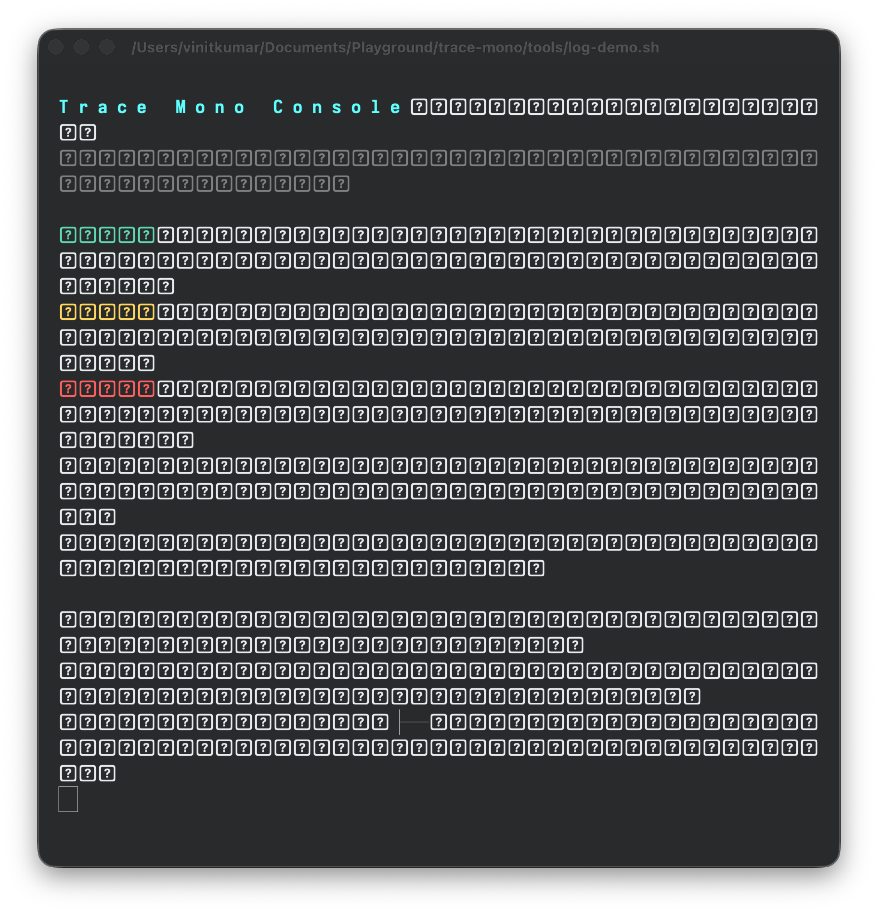
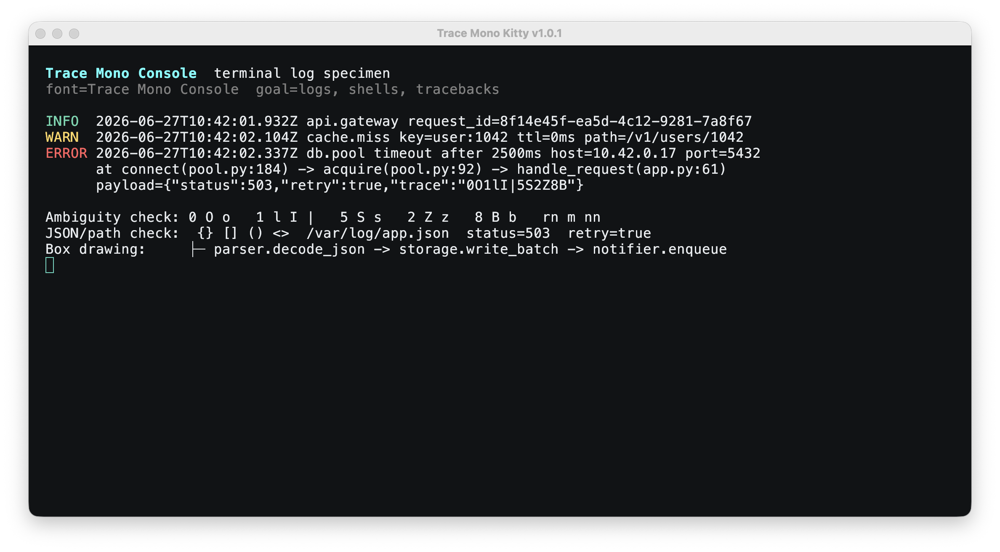

# Trace Mono

Trace Mono is an Iosevka-derived monospace font family designed for consoles,
terminals, and long log-reading sessions.

The first cut focuses on the text that shows up constantly in logs:
timestamps, paths, JSON, stack traces, shell output, UUIDs, HTTP status codes,
and dense punctuation. It is intentionally plain, sharp, and functional.

## Design Goals

- Clear distinction between `0 O o`, `1 l I |`, `5 S`, `2 Z`, and `8 B`.
- Calm rhythm for timestamp-heavy text such as `2026-06-27T10:42:01.932Z`.
- Strong bracket and punctuation shapes for JSON, tracebacks, and shell logs.
- Reproducible source build using a checked-in Iosevka custom build plan.

## Families

- `Trace Mono Console`: default terminal cut.
- `Trace Mono Inspect`: slightly roomier log-inspection cut.

## Build

```sh
python3 -m pip install -r requirements.txt
python3 tools/validate.py
```

Generated fonts are written to `fonts/ttf/`.

The production source plan is in `sources/iosevka-private-build-plans.toml`.
Build it from an Iosevka source checkout by copying that file to
`private-build-plans.toml`, then running:

```sh
npm run build -- ttf::TraceMonoConsole --jCmd=2
npm run build -- ttf::TraceMonoInspect --jCmd=2
```

## Terminal Screenshots

### Ghostty



Use the example config in `examples/ghostty.config`:

```ini
font-family = "Trace Mono Console"
font-size = 16
```

### Kitty



Use the example config in `examples/kitty.conf`:

```conf
font_family Trace Mono Console
font_size 16
```

The terminal sample text is in `tools/log-demo.sh`. The checked-in PNGs are
real macOS window captures from Ghostty and Kitty using the built TTF installed
in `~/Library/Fonts`.

To refresh the screenshots on macOS, install the fonts, launch each terminal
with the example config and `tools/log-demo.sh`, then capture the app window
with `screencapture -l <window-id>`.

## Install Locally On macOS

```sh
cp fonts/ttf/*.ttf ~/Library/Fonts/
```

Then choose `Trace Mono Console` or `Trace Mono Inspect` in your terminal.

## Install Script

macOS and Linux:

```sh
./install.sh
```

Windows PowerShell:

```powershell
.\install.ps1
```

The Unix installer copies TTF files into `~/Library/Fonts` on macOS and
`${XDG_DATA_HOME:-~/.local/share}/fonts/trace-mono` on Linux. The Windows
installer copies the TTF files into the Windows Fonts folder.

## Specimen

Open `specimen/index.html` after building. It uses the generated TTF files and
shows terminal/log-oriented samples.

## License

SIL Open Font License 1.1. See `OFL.txt`.

Trace Mono is derived from Iosevka and keeps the same OFL-compatible licensing
model. See `sources/iosevka-private-build-plans.toml` for the custom build
configuration.
